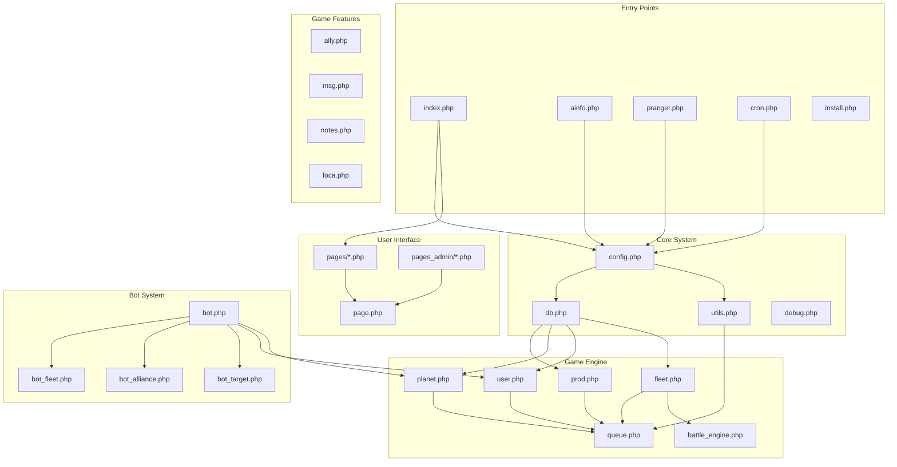
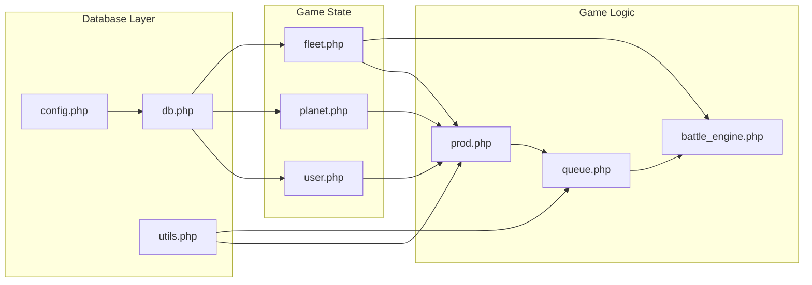
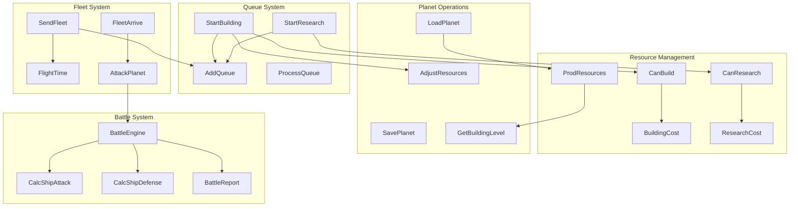
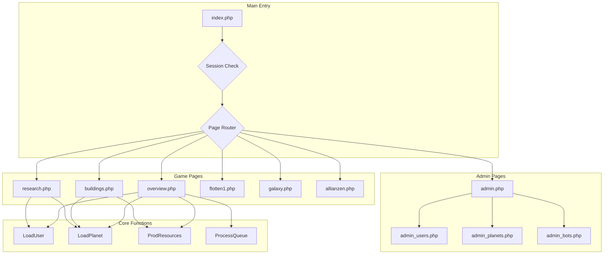
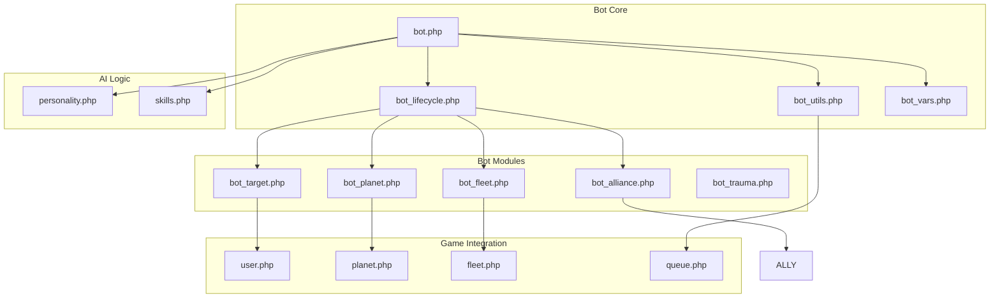

# OGame Architecture Diagram

This document provides visual representations of the OGame codebase architecture and dependencies.

## System Architecture Overview



## Core Module Dependencies



## Function Call Hierarchy



## Page Controller Flow



## Bot System Architecture



## Database Access Pattern

```mermaid
graph TB
    subgraph "Application Layer"
        PAGES[Page Controllers]
        ADMIN[Admin Controllers]
        BOTS[Bot System]
        CRON[Cron Jobs]
    end
    
    subgraph "Business Logic"
        USER[user.php]
        PLANET[planet.php]
        FLEET[fleet.php]
        ALLY[ally.php]
        QUEUE[queue.php]
    end
    
    subgraph "Data Access"
        DB[db.php]
        DBQUERY[dbquery()]
        DBARRAY[dbarray()]
        ADDROW[AddDBRow()]
    end
    
    subgraph "Database"
        MYSQL[(MySQL Database)]
        TABLES[Tables: users, planets, fleets, etc.]
    end
    
    PAGES --> USER
    PAGES --> PLANET
    PAGES --> FLEET
    ADMIN --> USER
    ADMIN --> PLANET
    BOTS --> USER
    BOTS --> PLANET
    CRON --> QUEUE
    
    USER --> DB
    PLANET --> DB
    FLEET --> DB
    ALLY --> DB
    QUEUE --> DB
    
    DB --> DBQUERY
    DB --> DBARRAY
    DB --> ADDROW
    
    DBQUERY --> MYSQL
    DBARRAY --> MYSQL
    ADDROW --> MYSQL
    
    MYSQL --> TABLES
```

## Security and Session Flow

```mermaid
graph TD
    subgraph "Entry Point"
        REQUEST[HTTP Request]
        INDEX[index.php]
    end
    
    subgraph "Security Checks"
        CONFIG_CHECK{Config Exists?}
        SESSION_CHECK{Session Valid?}
        SECURITY_CHECK[SecurityCheck()]
        FREEZE_CHECK{Universe Frozen?}
    end
    
    subgraph "User Context"
        LOAD_USER[LoadUser()]
        GLOBAL_USER[GlobalUser]
        LOAD_UNI[LoadUniverse()]
        GLOBAL_UNI[GlobalUni]
    end
    
    subgraph "Page Processing"
        PAGE_ROUTER{Page Router}
        GAME_PAGES[Game Pages]
        ADMIN_PAGES[Admin Pages]
    end
    
    REQUEST --> INDEX
    INDEX --> CONFIG_CHECK
    CONFIG_CHECK -->|No| INSTALL[install.php]
    CONFIG_CHECK -->|Yes| SESSION_CHECK
    SESSION_CHECK -->|No| REDIRECT[RedirectHome()]
    SESSION_CHECK -->|Yes| SECURITY_CHECK
    SECURITY_CHECK --> FREEZE_CHECK
    FREEZE_CHECK -->|Frozen & Not Admin| ERROR[Access Denied]
    FREEZE_CHECK -->|OK| LOAD_USER
    LOAD_USER --> GLOBAL_USER
    LOAD_USER --> LOAD_UNI
    LOAD_UNI --> GLOBAL_UNI
    GLOBAL_USER --> PAGE_ROUTER
    GLOBAL_UNI --> PAGE_ROUTER
    PAGE_ROUTER --> GAME_PAGES
    PAGE_ROUTER --> ADMIN_PAGES
```

---

*These diagrams illustrate the high-level architecture and relationships in the OGame codebase. They help visualize how different components interact and depend on each other.*